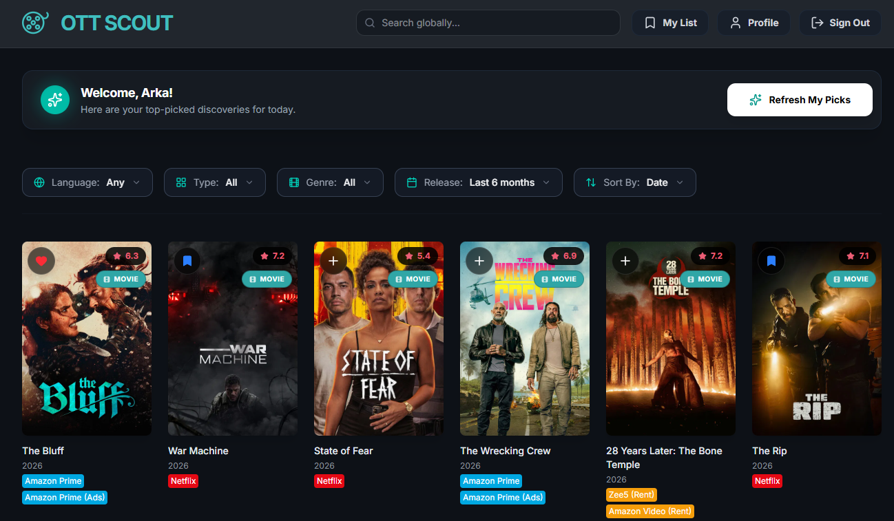

# 🎬 OTT Scout: AI-Powered Personalized Streaming 🍿



[](https://fastapi.tiangolo.com/)
[](https://reactjs.org/)
[](https://www.postgresql.org/)
[](https://tailwindcss.com/)
[](https://ollama.ai/)

**OTT Scout** is the ultimate entertainment companion that solves the "what to watch" dilemma. By combining the vast **TMDB** database with **Local AI (Ollama)** and **Supabase** synchronization, it provides a deeply personalized discovery experience tailored to *your* subscriptions and *your* taste.

---

## 🔥 Key Features

### 🧠 Deep-Taste AI Engine
*   **Conversational Discovery**: Chat with the built-in AI scout using natural language ("Gritty crime thrillers like Mirzapur but in English").
*   **Taste Synthesis**: Every interaction (Like, Dislike, Watch) feeds into a local GPU-optimized LLM that builds a complex multidimensional profile of your preferences.
*   **Bias-Free Diversity**: Specifically optimized to balance genres and languages, ensuring high-quality Hindi and regional content gets equal spotlight alongside global blockbusters.

### 📺 Subscription-First "Watch Now"
*   **Zero-Noise Filtering**: Connect your OTT platforms (Netflix, Prime, Hotstar, JioCinema, etc.). The app hides anything you can't stream, ensuring every recommendation is actionable.
*   **Direct-to-Platform Routing**: Skip the manual search. Our **"Watch Now"** system generates deep-search links that drop you directly into the search bar of your favorite streaming service.

### 📧 Weekly Scout Automations
*   **Personalized Newsletters**: Receive a weekly digest of top 5 hand-picked recommendations delivered straight to your inbox.
*   **Actionable Links**: Every email includes one-click "Watch Now" buttons that sync with your session for a seamless cross-device experience.

### ⚡ Premium UI/UX
*   **Sleek Dark Mode**: A gorgeous, glassmorphic interface designed for cinematic immersion.
*   **Skeleton Loaders**: Fast, glitch-free loading states for a smooth browsing experience.
*   **Responsive Details**: Deep meta-data, high-fidelity backdrops, and integrated YouTube trailers in a fluid modal interface.

---

## 🛠️ Technical Spotlight: The Recommendation Pipeline

OTT Scout uses a multi-stage **Hybrid Intelligence** pipeline to ensure your feed is never stale:

1.  **Candidate Gathering**: The engine pulls ~500 candidates from 5 distinct sources: Global Trending, Language-Specific Popularity, Genre Discovery, Collaborative Filtering (Similar Items), and **Semantic Vector Search**.
2.  **Intelligent Balancing**: To prevent "Popularity Bias" (where English blockbusters drown out regional gems), we use a weighted round-robin balancer that guarantees variety in language and genre.
3.  **Vector Discovery**: We generate a **"Taste Vector"** (weighted average embedding) of your entire watch history. This allows the system to find movies that feel similar thematically, even if they share no common actors or genres.
4.  **AI Reranking**: The top 100 candidates are sent to a local LLM (Ollama/Gemma). The AI analyzes your complex profile—including dislikes—to pick the final 20 and provides a human-readable reason for each.
5.  **Availability Enforcement**: Finally, the system checks real-time OTT availability in your region, filtering for your specific subscriptions before you even see the results.

---

## 🛠️ Technology Stack

| Layer | Technologies |
|---|---|
| **Frontend** | React 18, Vite, Tailwind CSS, Lucide Icons, Framer Motion |
| **Backend** | Python 3.9+, FastAPI, AsyncIO, HTTPX |
| **Database/Auth** | Supabase (PostgreSQL), Google OAuth |
| **AI/ML** | Ollama (Llama 3.2 / Gemma 2/3), Local Inference |
| **Integrations** | TMDB API (Content), Resend (Email Services) |

---

## 🚀 Speed-Start Guide

### 1. Prerequisites
- **Node.js** (v18+) & **Python** (3.10+)
- **Ollama** installed and running (`ollama run gemma2`)
- **TMDB API Key** (Free)

### 2. Backend Setup
```bash
# Navigate to backend
cd movie-recommender-backend

# Setup environment
python -m venv venv
./venv/Scripts/activate  # Windows
source venv/bin/activate # Mac/Linux

# Install & Run
pip install -r requirements.txt
# Create .env with TMDB_API_KEY, SUPABASE_URL, SUPABASE_KEY, RESEND_API_KEY
python run.py
```

### 3. Frontend Setup
```bash
# Navigate to frontend
cd movie-recommender-frontend

# Install & Launch
npm install
# Create .env with VITE_SUPABASE_URL, VITE_SUPABASE_ANON_KEY
npm run dev
```

---

## 📱 Screenshots

<div align="center">
  
</div>

---

## 📄 License & Contribution
This project is open-source. Feel free to fork, submit PRs, and build the future of streaming discovery!
