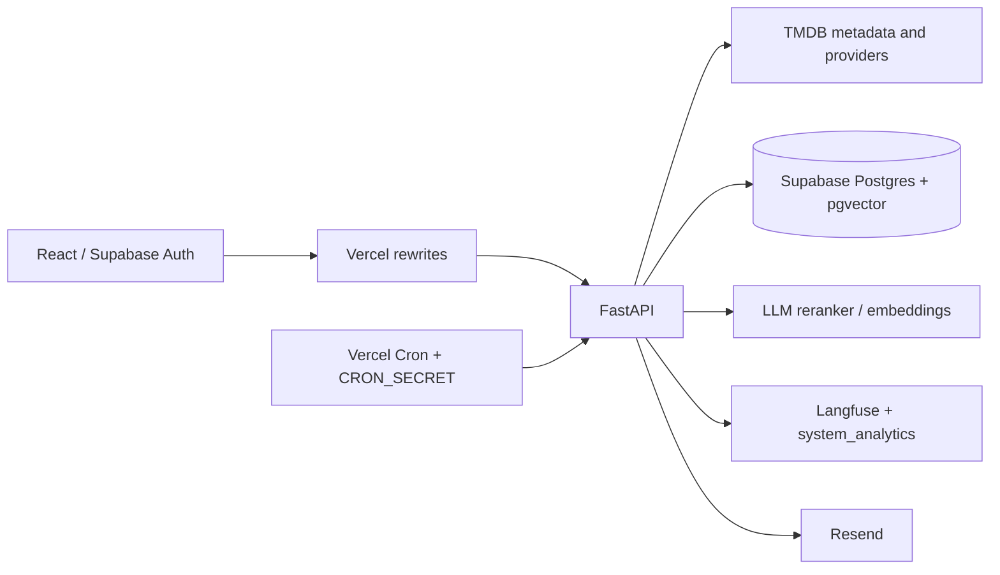

# OTT Scout

OTT Scout is a full-stack recommendation product for finding movies and TV shows across Indian streaming services. It combines FastAPI, React, Supabase/PostgreSQL with pgvector, TMDB metadata, hybrid retrieval, optional LLM reranking, semantic caching, Langfuse tracing, and Resend notifications.

The project is evaluated as an engineering system. Claims below distinguish deterministic offline results from live production observations.

## Architecture



## Offline evaluation

Run the reproducible benchmark:

```powershell
python evaluation/run_evaluation.py
```

The frozen dataset expands three preference templates into 36 deterministic cases covering regional languages, subscription constraints, disliked genres/actors, “like X but not Y” queries, missing metadata, provider failures, duplicate titles, hallucinated availability, and cold/warm cache labels. It measures Precision@3, Recall@3, NDCG@3, diversity, catalog coverage, regional-language representation, subscription compliance, metadata-error rate, token usage, and estimated LLM cost. The generated report is [evaluation/REPORT.md](evaluation/REPORT.md).

| Strategy | P@3 | R@3 | NDCG@3 | Diversity | Subscription compliance | Tokens | Cost / recommendation |
|---|---:|---:|---:|---:|---:|---:|---:|
| Keyword | 0.778 | 0.889 | 0.875 | 0.889 | 0.889 | 0 | $0.000000 |
| Dense | 0.778 | 0.889 | 0.875 | 0.889 | 0.889 | 0 | $0.000000 |
| Hybrid | 0.778 | 0.889 | 0.901 | 0.889 | 0.889 | 0 | $0.000000 |
| Hybrid + reranking | 0.778 | 0.889 | 0.901 | 1.000 | 1.000 | 780 | $0.000460 |
| Hybrid + semantic cache | 0.778 | 0.889 | 0.901 | 1.000 | 1.000 | 0 | $0.000000 |

These are offline ranking results, not proof of live TMDB, Supabase, provider, email, or LLM performance. The `rerank` and `cache` rows use deterministic stand-ins for those stages.

## Continuous verification and load probe

GitHub Actions runs Python compilation, the 36-case benchmark, smoke tests, frontend lint, frontend production build, npm audit, and pip-audit on pushes and pull requests. Dependency audits are non-blocking while existing dependency debt is triaged, but their findings remain visible in the workflow.

Run the reproducible HTTP probe against a local or deployed endpoint:

```powershell
python evaluation/load_test.py --url https://ottscout.arkocodes.dev/api/health --requests 100 --concurrency 10
```

Pass `--warm-url` to compare alternating cold/warm targets. The probe reports P50/P95 latency, requests per second, concurrent request count, failure rate, and estimated cost. It does not infer server cache state; recommendation cost and cache telemetry must come from `/api/analytics/summary`.

## Reliability and observability

Recommendation traces are stored in `system_analytics` when Supabase is configured and exposed through `/analytics/summary`. The response includes observed P50/P90/P95 latency, cache hit rate, token totals, estimated cost, quality scores, recent traces, and operational counters.

Tracked operational counters include provider failures, email/notification success and failure, and duplicate notifications prevented. Supabase query latency and delivery-provider message IDs should be added to the same event model before making an SLA claim.

Example trace shape:

```json
{
  "id": "tr_00042",
  "type": "recommendation",
  "latency_ms": 1840,
  "tokens": 780,
  "cache_hit": false,
  "status": "ok"
}
```

Failure behavior is intentionally conservative: TMDB/provider failures remove unavailable items from the result; missing Resend credentials report a failed delivery; recommendation exceptions record an error trace; the semantic cache fails open.

## Security model

- Set `REQUIRE_AUTH=true` in production. The backend validates the Supabase bearer token and checks that the authenticated subject owns the requested user resource.
- Keep Supabase service credentials, TMDB, LLM, Resend, and cron secrets server-side. The frontend sends only the Supabase access token.
- Apply [supabase/migrations/001_security_and_history.sql](supabase/migrations/001_security_and_history.sql) to enable RLS for user data, recommendation history, and notification deliveries.
- Admin analytics should be protected by an authenticated admin allowlist or gateway policy before exposing it publicly; the current endpoint is not a production admin boundary.
- Cron endpoints require `CRON_SECRET` unless `ALLOW_UNAUTHENTICATED_CRON=true` is explicitly used for local development. `X-Cron-Run-Id` prevents replay within the process window.
- The current rate limiter is process-local. Use a shared edge/Redis limiter for multi-instance enforcement.
- `/user/{user_id}/data-export` and `/user/{user_id}/data` provide portability and deletion flows; deletion does not delete the Supabase Auth account.

## Deployment

Vercel serves the React app and rewrites `/api/*` to the FastAPI function. Vercel Cron invokes the weekly recommendation and daily watching routes. The known live deployment was verified at `https://www.ottscout.arkocodes.dev`; the domain/DNS state is time-sensitive and should be rechecked before a release.

## Local development

```powershell
cd movie-recommender-backend
python -m venv venv
venv\Scripts\Activate.ps1
pip install -r requirements.txt
python run.py
```

```powershell
cd movie-recommender-frontend
npm install
npm run dev
```

Required secrets are environment variables. Never commit `.env` files or service-role keys.

## Known limitations

- The offline benchmark has 36 synthetic cases; it still needs a larger anonymized relevance set and a live replay harness.
- No measured burst/concurrency or availability study is included, so this README does not claim automatic burst handling or real-time behavior.
- Historical verification confirmed the notification UI/API and deployment, but actual Resend delivery was not fully exercised.
- Frontend lint has no errors but still reports four pre-existing React hook warnings; a production-readiness claim should wait for that cleanup.
- Analytics currently retains an in-memory sliding window plus optional Supabase history; percentile samples are observed request traces, not a formal SLO system.

## Why this is a strong portfolio project

OTT Scout demonstrates AI application design, Python backend work, React integration, retrieval evaluation, PostgreSQL/pgvector data flows, external-provider failure handling, tenant isolation, background jobs, and cost-aware observability.
